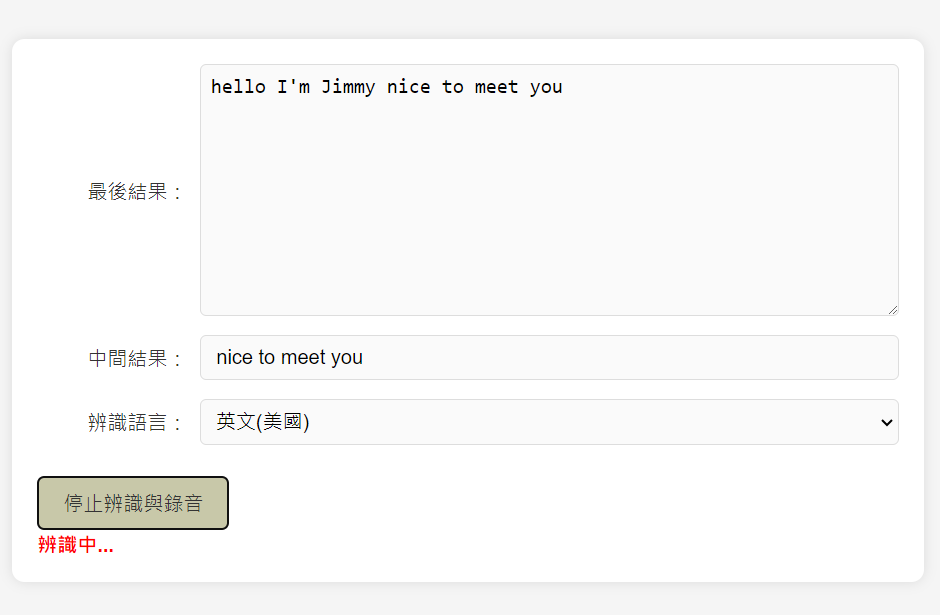

# Free-Speech-to-Text-and-Record-Web

# 語音辨識與錄音應用

這是一個使用 HTML、CSS 和 JavaScript 開發的簡單網頁應用，能夠進行語音辨識並錄音。使用者可以選擇語言進行辨識，並下載錄音。

## 功能

- **語音辨識**：使用 Web Speech API 進行實時語音辨識，支持中文（台灣）和英文（美國）兩種語言。
- **中間結果顯示**：在辨識過程中顯示中間結果，並在辨識完成後顯示最終結果。
- **錄音功能**：使用者可以錄製語音並下載錄音文件。

## 注意事項

- 本應用程序依賴於瀏覽器的語音辨識功能，建議使用 Google Chrome 25 版以上的瀏覽器。
- 請確保已授予瀏覽器使用麥克風的權限。

## 授權

本項目使用 MIT 許可證。詳細內容請參閱 [LICENSE](LICENSE) 文件。